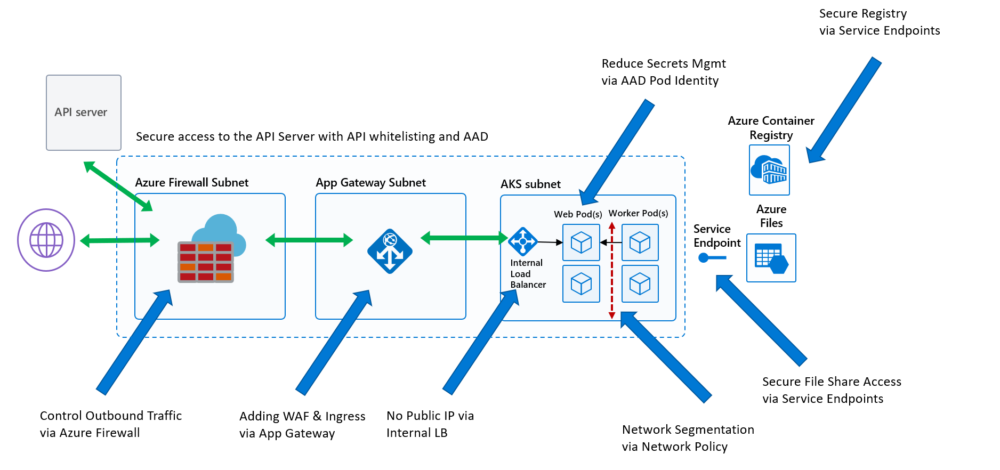

# Secure AKS Configuration

## Introduction 
This is an example secure configuration that follows the AKS best practices. https://aka.ms/aks/bestpractices

To demonstrate the security controls we are using, we will use a sample application comprised of a web FrontEnd and a BackEnd that is classifying fruit images that are stored in Azure Storage.

## Architecture

Here is a before and after architecture picture of what we are going to be walking through. As you can see from the first diagram, it is an out of the box AKS setup which works for most organizations, but typically not those in a highly regulated environment.


However, the second diagram makes use of custom subnets, Network Firewall, Web Application Firewall, service segmentation (network policies), service endpoints and API whitelisting, which are controls most regulated enterprises are looking for.




## The Walkthrough 
You may choose to walk step by step through this guide or automatically get the cluster up and running by executing the setup script (if you do make sure you change the needed variables like, subscription, username and password).

## Variable Setup

We are going to create and configure a number of resources, so we'll need quite a few variables. While they are pretty straight forward, please note them and what they do.


```bash
PREFIX="secdemo"
RG="${PREFIX}-rg"
LOC="westus2"
AKSNAME="${PREFIX}"
VNET_NAME="${PREFIX}vnet"
AKSSUBNET_NAME="${PREFIX}akssubnet"
SVCSUBNET_NAME="${PREFIX}svcsubnet"
APPGWSUBNET_NAME="${PREFIX}appgwsubnet"
# DO NOT CHANGE FWSUBNET_NAME - This is currently a requirement for Azure Firewall.
FWSUBNET_NAME="AzureFirewallSubnet"
IDENTITY_NAME="${PREFIX}identity"
FWNAME="${PREFIX}fw"
FWPUBLICIP_NAME="${PREFIX}fwpublicip"
FWIPCONFIG_NAME="${PREFIX}fwconfig"
FWROUTE_TABLE_NAME="${PREFIX}fwrt"
FWROUTE_NAME="${PREFIX}fwrn"
AGNAME="${PREFIX}ag"
AGPUBLICIP_NAME="${PREFIX}agpublicip"
STORAGE_NAME="${PREFIX}${DATE}storage"
FILES_NAME="fruit"
# IMPORTANT!! UPDATE TO YOUR SUBSCRIPTION NAME
AZURE_ACCOUNT_NAME="gobyers-int"
ACR_NAME="gordopremiumreg"
K8S_VERSION=1.13.5
VM_SIZE=Standard_D2s_v3
PLUGIN=azure
SUBID=$(az account show -s $AZURE_ACCOUNT_NAME -o tsv --query 'id')
ACR_ID=$(az acr show --name $ACR_NAME --query "id" --output tsv)
```

## Setup correct subscription 

Make sure you are using the desired subscription

```bash
az account set -s $AZURE_ACCOUNT_NAME
```

## Create Resource Group
Create the resource group where all the custom resources will be deployed.

```bash
az group create --name $RG --location $LOC
```

## AKS Creation VNET Pre-requisites

This section walks through the Virtual Network (VNET) setup pre-requisites before actually creating the AKS Cluster. One caveat on the subnet sizing below. All subnets were selected as /24 because it made things simple, but *that is not a requirement*. Please work with your networking teams to size the subnets appropriately for your organization's needs.

Here is a brief description of each of the dedicated subnets leveraging the variables populated from above:

* AKSSUBNET_NAME - This is where the AKS Cluster will get deployed.
* SVCSUBNET_NAME - This is the subnet that will be used for **Kubernetes Services** that are exposed via an Internal Load Balancer (ILB). This mean the ILB internal IP will be from this subnet address space. By doing it this way we do not take away from the existing IP Address space in the AKS subnet that is used for Nodes and Pods.
* FWSUBNET_NAME - This subnet is dedicated to Azure Firewall. **NOTE: The name cannot be changed at this time.**
* APPGWSUBNET_NAME - This subnet is dedicated to Azure Application Gateway v2 which will serve a dual purpose. It will be used as a Web Application Firewall (WAF) as well as an Ingress Controller. **NOTE: Azure App Gateway Ingress Controller is in preview at this time.**

```bash
az network vnet create \
    --resource-group $RG \
    --name $VNET_NAME \
    --address-prefixes 10.42.0.0/16 \
    --subnet-name $AKSSUBNET_NAME \
    --subnet-prefix 10.42.1.0/24
az network vnet subnet create \
    --resource-group $RG \
    --vnet-name $VNET_NAME \
    --name $SVCSUBNET_NAME \
    --address-prefix 10.42.2.0/24    
az network vnet subnet create \
    --resource-group $RG \
    --vnet-name $VNET_NAME \
    --name $APPGWSUBNET_NAME \
    --address-prefix 10.42.3.0/24
az network vnet subnet create \
    --resource-group $RG \
    --vnet-name $VNET_NAME \
    --name $FWSUBNET_NAME \
    --address-prefix 10.42.4.0/24

# Get $VNETID & $SUBNETID
VNETID=$(az network vnet show -g $RG --name $VNET_NAME --query id -o tsv)
SUBNETID=$(az network vnet subnet show -g $RG --vnet-name $VNET_NAME --name $AKSSUBNET_NAME --query id -o tsv)
```

## Create AKS Service Principal
This section walks through creating a Service Principal which will be used by AKS to create and update the cluster-managed azure resources. It is this Service Principal that actually creates the underlying Azure Resources such as Storage, Load Balancers, etc. used by AKS. 
We will grant the necessary permissions to this Service Principal later on.

If you want to create it and automatically store its APPID and PASSWORD values to the respective variables:
```bash
eval "$(az ad sp create-for-rbac -n ${PREFIX}sp --skip-assignment | jq -r '. | to_entries | .[] | .key + "=\"" + .value + "\""' | sed -r 's/^(.*=)/\U\1/')"
```

**Alternatively:** If this is too much bash-foo, you are not running bash or want to manually do it, run instead:
```bash
az ad sp create-for-rbac -n ${PREFIX}sp --skip-assignment
# Take the SP Creation output from above command and fill in Variables accordingly
APPID="<SERVICE_PRINCIPAL_APPID_GOES_HERE>"
PASSWORD="<SERVICEPRINCIPAL_PASSWORD_GOES_HERE>"
```

## Creating Azure Firewall 

This section walks through setting up Azure Firewall inbound and outbound rules. The main purpose of the firewall here is to help organizations setup ingress and egress traffic rules so the AKS Cluster is not open to the world and cannot reach out to everything on the Internet at the same time.

**NOTE 1: Completely locking down inbound and outboudn rules for AKS is not supported and will result in a broken cluster.**

**NOTE 2: There are no inbound rules required for AKS to run. The only time an inbound rule is required is to expose a workload/service.**

**NOTE 3: Outbound/Egress traffic from an AKS cluster can be controlled but not fully locked as AKS nodes still need to communicate with the master Control Plane**
**See: https://aka.ms/aks/egress**

We start by creating a Public IP address for the FW and then get into creating the Azure Firewall itself along with all of the Network (think ports and protocols) and Application (think egress traffic based on FQDNs) rules. 

If you want to lock down destination IP Addresses on some of the firewall rules you will have to use the destination IP Addresses for the datacenter region you are deploying into due to how AKS communicates with the managed control plane. The list of IP Addresses per region in XML format can be found and downloaded by clicking [here](https://www.microsoft.com/en-us/download/details.aspx?id=56519).

**NOTE: Azure Firewall can have additional costs**

```bash
# Create Public IP
az network public-ip create -g $RG -n $FWPUBLICIP_NAME -l $LOC --sku "Standard"
# Create Firewall
az extension add --name azure-firewall
az network firewall create -g $RG -n $FWNAME -l $LOC
# Configure Firewall IP Config
# This command will take a few mins.
az network firewall ip-config create -g $RG -f $FWNAME -n $FWIPCONFIG_NAME --public-ip-address $FWPUBLICIP_NAME --vnet-name $VNET_NAME
# Capture Firewall IP Address for Later Use
FWPUBLIC_IP=$(az network public-ip show -g $RG -n $FWPUBLICIP_NAME --query "ipAddress" -o tsv)
FWPRIVATE_IP=$(az network firewall show -g $RG -n $FWNAME --query "ipConfigurations[0].privateIpAddress" -o tsv)
# Validate Firewall IP Address Values
echo $FWPUBLIC_IP
echo $FWPRIVATE_IP
# Create UDR & Routing Table
az network route-table create -g $RG --name $FWROUTE_TABLE_NAME
az network route-table route create -g $RG --name $FWROUTE_NAME --route-table-name $FWROUTE_TABLE_NAME --address-prefix 0.0.0.0/0 --next-hop-type VirtualAppliance --next-hop-ip-address $FWPRIVATE_IP
# Add Network FW Rules
# IMPORTANT!!: Here I'm adding a simplified list to represent the WESTUS2 DataCenter, for the concrete list please check https://aka.ms/azureipranges
# Destination IP Addresses (US West 2 DC): 13.0.0.0/8 20.0.0.0/8 23.0.0.0/8 40.0.0.0/8 51.0.0.0/8 52.0.0.0/8 65.0.0.0/8 70.0.0.0/8 104.0.0.0/8 131.0.0.0/8 157.0.0.0/8 168.0.0.0/24 191.0.0.0/8 199.0.0.0/8 207.0.0.0/8 209.0.0.0/8
# Port 53 is DNS
# Port 445 is for SMB needed later on for the integration with Azure Files. You don't need this if you have established a storage service endpoint

az network firewall network-rule create -g $RG -f $FWNAME --collection-name 'aksfwnr' -n 'netrules' --protocols 'TCP' --source-addresses '*' --destination-addresses '13.0.0.0/8' '20.0.0.0/8' '23.0.0.0/8' '40.0.0.0/8' '51.0.0.0/8' '52.0.0.0/8' '65.0.0.0/8' '70.0.0.0/8' '104.0.0.0/8' '131.0.0.0/8' '157.0.0.0/8' '168.0.0.0/24' '191.0.0.0/8' '199.0.0.0/8' '207.0.0.0/8' '209.0.0.0/8' --destination-ports 9000 22 443 53 445 --action allow --priority 100

# Add Application FW Rules
# IMPORTANT: Here I'm adding a subset of the recommended FQDNs. 
# For the complete list and explanation of minimum required and recommended FQDNs please check https://aka.ms/aks/egress
# Also, make sure to have into account any specific egress needs of your workloads.
az network firewall application-rule create -g $RG -f $FWNAME --collection-name 'aksfwar' -n 'fqdn' --source-addresses '*' --protocols 'http=80' 'https=443' --target-fqdns "${ACR_NAME}.azurecr.io" '*.azmk8s.io' 'aksrepos.azurecr.io' '*blob.core.windows.net' '*mcr.microsoft.com' '*.cdn.mscr.io' 'login.microsoftonline.com' 'management.azure.com' '*ubuntu.com' --action allow --priority 100

# Associate AKS Subnet to FW
az network vnet subnet update -g $RG --vnet-name $VNET_NAME --name $AKSSUBNET_NAME --route-table $FWROUTE_TABLE_NAME
```

## Assign Service Principal Permissions to VNET
Now we will assign the needed permissions to the AKS service principal. This will normally be done automatically if the user deploying has the needed assignment permissions, we will be doing it explicitly here. If you get an error doing the below, you might need to contact the subscription administrator.

```bash
az role assignment create --assignee $APPID --scope $VNETID --role Contributor

# If you have one or more Azure Container Registries you want the cluster to be able to pull from make sure you add pull permissions for them too
az role assignment create --assignee $APPID --role acrpull --scope $ACR_ID 
```

## Create AKS Cluster
Congratulations! You got here, it's show time.
Now we will create the AKS cluster.

```bash
az aks create -g $RG -n $AKSNAME -l $LOC \
  --node-count 3 -k $K8S_VERSION -a monitoring \
  --network-plugin $PLUGIN ---generate-ssh-keys \
  --network-policy azure \
  --service-cidr 10.41.0.0/16 \
  --dns-service-ip 10.41.0.10 \
  --docker-bridge-address 172.17.0.1/16 \
  --vnet-subnet-id $SUBNETID \
  --service-principal $APPID \
  --client-secret $PASSWORD
```

## Get AKS Cluster Credentials

You will have to wait a few moments for the AKS Cluster to finish provisioning after the command above completes. The first command below will help you check the current state in terms of running or completed.

Once the AKS cluster has finished provisioning you can run the get-credentials sub command to get the corresponding kubeconfig, and then get nodes to make sure everything is working.

```bash
# Check Provisioning Status of AKS Cluster - ProvisioningState should say 'Succeeded'
az aks list -o table
# Get AKS Credentials so kubectl works
az aks get-credentials -g $RG -n $NAME --admin
# Setup alias to kubectl becuase I am lazy. 
# If you don't do this, make sure to replace all 'k' instances with 'kubectl'.
alias k="kubectl"
# Get Nodes
k get nodes -o wide
```


## Create Azure App Gateway v2

This section is pretty straight forward in that we are creating an instance of Azure Application Gateway v2 and injecting it into a dedicated subnet in our VNET. All inbound traffic will be routed through the Azure Application Gateway v2 instance which is protecting traffic using its WAF capabilities while acting as a kubernetes Ingress Controller at the same time.

**NOTE: The Private IP Address below has to be from the subnet the Azure Application Gateway v2 is going into.**

**NOTE: Azure Application Gateway requires a Public IP address at this time (meaning cannot have Private IP only) in order for WAF v2 to work.**
**As a result, if you Enterprise Setup requires private IPs only even for the WAF, do leverage one of the options from the Azure Marketplace that supports this**

```bash
# Create Azure App Gateway v2 with WAF and autoscale.
# Create Public IP First.
az network public-ip create -g $RG -n $AGPUBLICIP_NAME -l $LOC --sku "Standard"
# Create App Gateway using WAF_v2 SKU.
az network application-gateway create \
  --name $AGNAME \
  --resource-group $RG \
  --location $LOC \
  --min-capacity 2 \
  --frontend-port 80 \
  --http-settings-cookie-based-affinity Disabled \
  --http-settings-port 80 \
  --http-settings-protocol Http \
  --routing-rule-type Basic \
  --sku WAF_v2 \
  --private-ip-address 10.42.3.12 \
  --public-ip-address $AGPUBLICIP_NAME \
  --subnet $APPGWSUBNET_NAME \
  --vnet-name $VNET_NAME
```

## Azure Identity Creation

Azure Application Gateway requires a way for the cluster ingress controller component to update the Azure resource. This is done by leveraging Pod Identity, which enables Kubernetes applications to access cloud resources securely with Azure Active Directory (AAD). More info https://github.com/Azure/aad-pod-identity. 
This section walks us through the pre-requisites needed to run Pod Managed Identities. Pod Managed Identities are nice as the lifecycle of the identity is managed by Azure AD and we can simply grant the identity the necessary permissions to interact with the needed Azure Resources and nothing more. In this particular case, we are going to grant the Azure Identity the necessary permissions to read and write rules in the Azure Application Gateway v2 instance created above. This is how the Ingress Rules that are created in kubernetes, manifest themselves inside of Azure Application Gateway v2. The nice thing about using this type of setup is that I am not having to manage secrets and worrying about how to inject those inside of my Pod so it has the proper credentials to be able to interact with resources.

**NOTE: This section leverage some more bash-foo to automatically update the needed files, it assumes you are running these commands from bash and in this projects root folder.**
**You may just manually update the needed files**

```bash
# Deploy Azure AD Pod Identity required infrastructure
k apply -f https://raw.githubusercontent.com/Azure/aad-pod-identity/master/deploy/infra/deployment-rbac.yaml

# Create User Identity
# I'm placing it on MC_RG where the AKS SP already has permissions, you may place it on another RG as long as you set up the right permissions
IDENTITY=$(az identity create -g "MC_${RG}_${AKSNAME}_${LOC}" -n $IDENTITY_NAME)
echo $IDENTITY
ASSIGNEEID=$(echo $IDENTITY | jq .clientId | tr -d '"')
echo $ASSIGNEEID
# Assign Reader Role, this is needed to test if Pod Identity is working only, not for App GW
ROLEREADER=$(az role assignment create --role Reader --assignee ${ASSIGNEEID} --scope "/subscriptions/${SUBID}/resourcegroups/MC_${RG}_${AKSNAME}_${LOC}")
echo $ROLEREADER

# Providing required permissions for MIC Using AKS SP
SCOPEID=$(echo $IDENTITY | jq .id | tr -d '"')
echo $SCOPEID
ROLEMIC=$(az role assignment create --role "Managed Identity Operator" --assignee $APPID --scope $SCOPEID)
echo $ROLEMIC

# Deploy User Azure AD Identity and update ResourceID,  ClientID and name in aadpodidentity.yaml with output of $IDENTITY
sed -i aadpodidentity.yaml -e "s/\(^.*ClientID: \).*/\1${ASSIGNEEID}/gI"
sed -i aadpodidentity.yaml -e 's@\(^.*ResourceID: \).*@\1'"${SCOPEID}"'@gI'
sed -i aadpodidentity.yaml -e "s/\(^.*name: \).*/\1${IDENTITY_NAME}/gI"

k apply -f aadpodidentity.yaml


# Deploy Pod to Identity Binding on k8s cluster and update name, AzureIdentity and Selector on aadpodidentitybinding.yaml with output of $IDENTITY
sed -i aadpodidentitybinding.yaml -e "s/\(^.*name: \).*/\1${PREFIX}-identity-binding/gI"
sed -i aadpodidentitybinding.yaml -e "s/\(^.*AzureIdentity: \).*/\1${IDENTITY_NAME}/gI"
sed -i aadpodidentitybinding.yaml -e "s/\(^.*Selector: \).*/\1${PREFIX}aadbindingselector/gI"

k apply -f aadpodidentitybinding.yaml

# Check out Sample Deployment Using AAD Pod Identity to ensure everything is working.
# Note: Update --subscriptionid --clientid and --resourcegroup in aadpodidentity-deployment.yaml accordingly.
sed -i aadpodidentity-deployment.yaml -e "s/\(^.*aadpodidbinding: \).*/\1${PREFIX}aadbindingselector/gI"
sed -i aadpodidentity-deployment.yaml -e "s/\(^.*subscriptionid=\).*/\1${SUBID}\"/gI"
sed -i aadpodidentity-deployment.yaml -e "s/\(^.*clientid=\).*/\1${ASSIGNEEID}\"/gI"
sed -i aadpodidentity-deployment.yaml -e "s/\(^.*resourcegroup=\).*/\1MC_${RG}_${AKSNAME}_${LOC}\"/gI"

k apply -f aadpodidentity-deployment.yaml

# Test if Pod Identity is working correctly
k get po --show-labels -o wide
k logs $(kubectl get pod -l "app=demo" -o jsonpath='{.items[0].metadata.name}')
# k exec $(kubectl get pod -l "app=demo" -o jsonpath='{.items[0].metadata.name}') -- /bin/bash -c env

# Clean the test
k delete -f aadpodidentity-deployment.yaml
```

## Setup App Gateway Ingress Controller
This section walks us through setting up the Azure Application Gateway v2 resource created above as a kubernetes Ingress Controller.

```bash
# Get helm
curl -LO https://git.io/get_helm.sh
chmod 700 get_helm.sh
./get_helm.sh

# Setup Helm
kubectl create serviceaccount --namespace kube-system tiller-sa
kubectl create clusterrolebinding tiller-cluster-rule --clusterrole=cluster-admin --serviceaccount=kube-system:tiller-sa
helm init --tiller-namespace kube-system --service-account tiller-sa
helm repo add application-gateway-kubernetes-ingress https://raw.githubusercontent.com/Azure/application-gateway-kubernetes-ingress/master/helm
helm repo update


# Install and Setup Ingress
# Grant AAD Identity Access to App Gateway

APPGATEWAYSCOPEID=$(az network application-gateway show -g $RG -n $AGNAME | jq .id | tr -d '"')
echo $APPGATEWAYSCOPEID
ROLEAGWCONTRIB=$(az role assignment create --role Contributor --assignee $ASSIGNEEID --scope $APPGATEWAYSCOPEID)
ROLEAGWREADER=$(az role assignment create --role Reader --assignee $ASSIGNEEID --scope "/subscriptions/${SUBID}/resourcegroups/${RG}")
ROLEAGWREADER2=$(az role assignment create --role Reader --assignee $ASSIGNEEID --scope $APPGATEWAYSCOPEID)
echo $ROLEAGWCONTRIB
echo $ROLEAGWREADER
echo $ROLEAGWREADER2

# Note: Update subscriptionId, resourceGroup, name, identityResourceID, identityClientID and apiServerAddress in agw-helm-config.yaml file with the following.
sed -i agw-helm-config.yaml -e "s/\(^.*subscriptionId: \).*/\1${SUBID}/gI"
sed -i agw-helm-config.yaml -e "s/\(^.*resourceGroup: \).*/\1${RG}/gI"
sed -i agw-helm-config.yaml -e "s/\(^.*name: \).*/\1${AGNAME}/gI"
sed -i agw-helm-config.yaml -e 's@\(^.*identityResourceID: \).*@\1'"${SCOPEID}"'@gI'
sed -i agw-helm-config.yaml -e "s/\(^.*identityClientID: \).*/\1${ASSIGNEEID}/gI"

APISERVER=$(az aks show -n $AKSNAME -g $RG --query 'fqdn' -o tsv)
sed -i agw-helm-config.yaml -e "s/\(^.*apiServerAddress: \).*/\1${APISERVER}/gI"

# Install App GW Ingress Controller with Helm
helm install --name $AGNAME -f agw-helm-config.yaml application-gateway-kubernetes-ingress/ingress-azure

# Check created resources
k get po,svc,ingress,deploy,secrets
helm list
```

## Deploy Workload

A little about this workload. As you can see from the original diagram at the top, there are two services.

The first service is a web front-end written in .NET Core that sets up a SignalR Hub for receiving real-time communication from the back-end worker node, which in turn relays that to the web client.

The second service is a tensorflow model that classifies pictures of fruit that are located in Azure Files. Each time an image has been classified it communicates back to the SignalR Hub setup on the web front-end which then relays that to the client.

This setup is different than your typical web to database communication as it flows the other way from back-end to front-end. Keep those communication paths in mind when we get to updating variables for communication between services as well as service segmentation.

**NOTE: Kubernetes volume mounting is not Azure Identity aware yet so when mounting Azure Files we still need to use traditional credentials which means creating a kubernetes secret.**

**NOTE: The application images are in a public Docker hub, whitelist docker.io or mirror them to your personal Container Registry that you whitelisted above**

```bash
## Deploy Workload
# Add Web Front-End

sed -i web.yaml -e "s/\(^.*azure-load-balancer-internal-subnet: \).*/\1\"${SVCSUBNET_NAME}\"/gI"
k apply -f web.yaml
k apply -f ingress-web.yaml

# Create storage account and add fruit images to it
az storage account create -n $STORAGE_NAME -g $RG -l $LOC
STORAGE_KEY=$(az storage account keys list -n $STORAGE_NAME -g $RG --query [0].'value' -o tsv)

az storage share create -n $FILES_NAME --account-key $STORAGE_KEY --account-name $STORAGE_NAME
az storage file upload-batch --destination $FILES_NAME --source ~/workbench/readydemos/WinterReady2019/security/fruit/ --account-name $STORAGE_NAME --account-key $STORAGE_KEY

# Create k8s secret with storage key
k create secret generic fruit-secret --from-literal=azurestorageaccountname=$STORAGE_NAME --from-literal=azurestorageaccountkey=$STORAGE_KEY

# Add Worker Back-End
k apply -f worker.yaml

# Check everything is deployed correctly
k get po,svc,ingress,deploy,secrets
```

## Check workload

```bash
az network public-ip show -g $RG -n $AGPUBLICIP_NAME --query "ipAddress" -o tsv
```

## Test Egress and Ingress
Go to the IP obtained in the last step and confirm ingress is working through the App GW and nowhere else.

Run the a test pod and try to egress to unauthorized endpoints to confirm egress is locked down. For convenience there is an example test pod in this project.

**Note: Remember that the cluster is locked down, so by default you won't be able to pull the test pod unless you whitelist docker.io or mirror the image to one of your whitelisted registries.**

```bash
k apply -f test-pod.yaml
k exec -it centos -- /bin/bash
# From imside the pod, run
curl superman.com 
# The above should not work
curl ubuntu.com
# This one should work since we allow ubuntu.com
```

## Service Segregation with Network Policies

This last section takes us through how to setup Service Segmentation inside of the AKS Cluster so that not just any service can talk to any other service. This is done via Network Policy.

**NOTE: The 10.42.2.232 IP Address below is the IP Address of the Internal Load Balancer (ILB) created above when Ingress was being setup. If you changed it, update the IP Address accordingly.**

```bash
# Network Policy Setup - This should return nothing to start.
k get networkpolicy
# Network Policy Testing
# This should work and return back html.
k exec -it centos -- curl 10.42.2.232
k apply -f np-denyall.yaml
# Now this should fail (timeout) as we laid down a blanket deny all ingress and egress traffic in the AKS Cluster
k exec -it centos -- curl 10.42.2.232
# Open up a new browser tab so that a new Web Socket (using SignalR) connection is established as existing web socket connections are already established and will continue to work.
# Apply network policy rules to allow incoming traffic from Ingress Controller as well as incoming traffic from the worker.
k apply -f np-web-allow-ingress.yaml
k apply -f np-web-allow-worker.yaml
# You should now see 3 Rules
k get networkpolicy
# This command should still fail as this IP Address is not in the allowed ingress network policy rules
k exec -it centos -- curl 10.42.2.232
# Check Public IP Address and Web Application should be working again.
```

## Define API server authorized IP ranges
In Kubernetes, the API server receives requests to perform actions in the cluster such as to create resources or scale the number of nodes. The API server is the central way to interact with and manage a cluster. To improve cluster security and minimize attacks, the API server should only be accessible from a limited set of IP address ranges.

To exmplify we will create a jumbox and whitelist it, so that only commands from that jumbox will work. Alternatively, I provide some examples for whitelisting your own machine.

```bash
# Create jumpbox with Ubtuntu as image and your machine user as username and your stored ssh keys
az vm create -n jumpbox -g $RG --image ubuntults

JUMPBOX=$(az vm show -d -n readyjumpbox -g $RG --query publicIps -o tsv)

# Whitelist Jumpbox and FW IP (so nodes can communicate)
az aks update -g $RG -n $AKSNAME --api-server-authorized-ip-ranges $FWPUBLIC_IP/32,$JUMPBOX/32

# Test whitelisting
ssh $JUMPBOX

# Inside jumpbox
curl -sL https://aka.ms/InstallAzureCLIDeb | sudo bash

az login
sudo az aks install-cli
az aks get-credentials -g $RG -n $NAME --admin

# Verify this works
kubectl get nodes

exit

# Back at your laptop
kubectl get nodes
# This should not work
```

**Alternatively to whitelist your laptop** 
```bash
CURRENT_IP=$(dig @resolver1.opendns.com ANY myip.opendns.com +short)

az aks update -g $RG -n $AKSNAME --api-server-authorized-ip-ranges $FWPUBLIC_IP/32,$CURRENT_IP/32

# Verify it still works
k get nodes 
```

